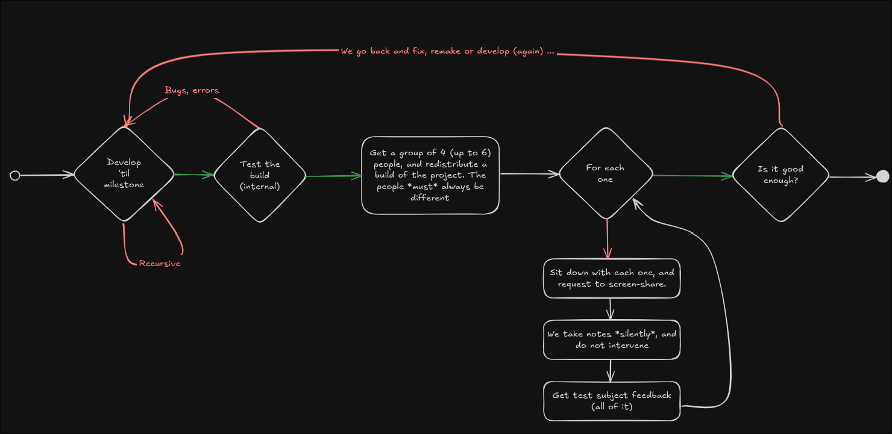

# Watcher

Watcher is an open-source game server client designed to make managing dedicated servers incredibly easy. Think of it as Steam, but for servers! With Watcher, you don't have to worry about port forwarding or networking configurations—just click "Play" and you're good to go!

## What is Watcher?

Watcher is the base application that handles networking, publishes a REST API for server management, and (most importantly) downloads and loads packages. Each package corresponds to a specific server implementation. For example, you could have packages for CS2, Minecraft, L4D2, CSGO, and more—all managed within the same app.

However, Watcher itself cannot open any server without these packages. It acts as the foundation for server management, allowing users to easily install and run server implementations.

## Current Development Status

Watcher is currently under heavy development, and we're aiming to deploy a demo by the end of **April 2025**. The demo will feature a simple real-time chat application, which will be released exclusively to our beta tester channels.

## Future Plans

We are working on a comprehensive Wiki that will:

- Explain the internal functions of Watcher.
- Provide detailed instructions on how to create and upload Watcher packages.
- Serve as a resource for developers, similar to the NixOS package repository.

Stay tuned for updates!

---

## Testing Workflow

At Rabbyte, we follow a structured testing workflow to ensure the quality of our builds. Here's how it works:

1. **Develop 'til milestone**
   Development continues until a specific milestone is reached.
2. **Test the build (internal)**
   The build is tested internally to identify bugs and errors. If issues are found, we go back to fix, remake, or redevelop as needed.
3. **Distribute to external testers**
   A group of 4–6 external testers is selected, and the build is redistributed. It's important that the testers are always different for each round of testing.
4. **For each tester:**

   - Sit down with the tester and request to screen-share.
   - Take notes silently without intervening.
   - Gather all feedback from the tester.
5. **Evaluate feedback**
   Based on the feedback, determine if the build is "good enough." If not, the process loops back to development.

This recursive workflow ensures that we catch issues early and refine the product iteratively.

---

## Contributing

Watcher is open-source, and we welcome contributions from the community! Whether you're interested in developing packages, improving the core app, or helping with documentation, we'd love to have you on board.

---

## License

Watcher is licensed under the [GPL-3.0](LICENSE). Feel free to use, modify, and distribute it as you see fit.

---

## Stay Connected

Follow us for updates and announcements:

- [Rabbyte GitHub](https://github.com/rabbytesoftware)
- [char2cs' X](https://x.com/char2cs)
