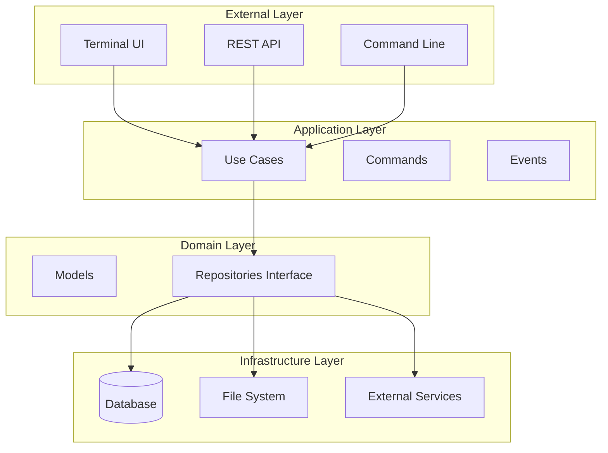
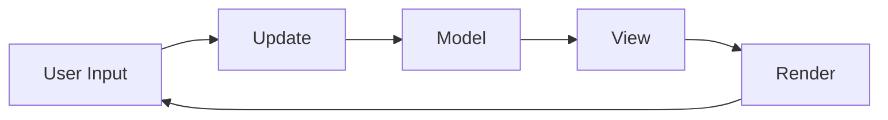

# Architecture Overview

This document provides a high-level overview of Quiver's package manager architecture, design patterns, and key components.

## System Architecture

Quiver is a **multi-platform, multi-paradigm package manager** that follows **Clean Architecture** principles with clear separation of concerns and dependency inversion.



## Core Components

### 1. **Application Entry Point**
- **Location**: `cmd/quiver/main.go`
- **Purpose**: Application bootstrap and initialization
- **Responsibilities**:
  - Initialize dependency injection container
  - Start core services (API, Watcher)
  - Launch Terminal UI

### 2. **Dependency Injection Container**
- **Location**: `internal/internal.go`
- **Purpose**: Centralized dependency management
- **Components**:
  - Core services (Configuration, Watcher)
  - Infrastructure layer
  - Repository layer
  - Use case layer
  - API layer

### 3. **Core Services**
- **Location**: `internal/core/`
- **Purpose**: Foundational application services
- **Components**:
  - **Configuration**: Settings and environment management
  - **Watcher**: Logging and monitoring
  - **Metadata**: Application information

## Layer Architecture

### API Layer (`/internal/api/`)

**Purpose**: HTTP REST API endpoints and middleware

**Key Components**:
- **Router**: Gin-based HTTP router
- **Controllers**: Request/response handling
- **Middleware**: Logging, recovery, CORS
- **Versioning**: API version management (v1)

**Responsibilities**:
- HTTP request/response handling
- Input validation and sanitization
- Authentication and authorization
- API documentation

**Dependencies**: Use Cases layer

### Use Cases Layer (`/internal/usecases/`)

**Purpose**: Business logic and application rules

**Key Components**:
- **ArrowsUsecase**: Arrow package management
- **QuiversUsecase**: Quiver server management
- **SystemUsecase**: System operations

**Responsibilities**:
- Business logic orchestration
- Data validation and transformation
- Error handling and logging
- Transaction management

**Dependencies**: Repository layer

### Repository Layer (`/internal/repositories/`)

**Purpose**: Data access abstraction

**Key Components**:
- **ArrowsRepository**: Arrow data operations
- **QuiversRepository**: Quiver data operations
- **SystemRepository**: System data operations

**Responsibilities**:
- Data persistence abstraction
- External service integration
- Data mapping and transformation
- Caching and optimization

**Dependencies**: Infrastructure layer

### Infrastructure Layer (`/internal/infrastructure/`)

**Purpose**: External concerns and technical implementation

**Key Components**:
- **Database**: Data persistence
- **File System**: File operations
- **Network**: External API calls
- **Runtime**: Process management

**Responsibilities**:
- Database connections and queries
- File system operations
- External service integration
- System resource management

**Dependencies**: None (bottom layer)

### Models Layer (`/internal/models/`)

**Purpose**: Domain entities and business objects

**Key Components**:
- **Arrow**: Game server package entity
- **Quiver**: Server instance entity
- **Port**: Network port management
- **Variable**: Configuration variables

**Responsibilities**:
- Domain entity definitions
- Business rule enforcement
- Data validation
- Entity relationships

**Dependencies**: None (pure domain)

## Design Patterns

### 1. **Clean Architecture**

**Principle**: Dependencies point inward, business logic is isolated

```
┌─────────────────┐
│   API Layer     │ ──┐
└─────────────────┘   │
┌─────────────────┐   │
│  Use Cases      │ ──┤ Dependencies
└─────────────────┘   │ point inward
┌─────────────────┐   │
│  Repositories   │ ──┤
└─────────────────┘   │
┌─────────────────┐   │
│ Infrastructure  │ ──┘
└─────────────────┘
```

### 2. **Dependency Injection**

**Implementation**: Constructor injection with centralized container

```go
// Dependency injection container
type Internal struct {
    core           *core.Core
    api            *api.API
    infrastructure *infrastructure.Infrastructure
    repositories   *repositories.Repositories
    usecases       *usecases.Usecases
}
```

### 3. **Repository Pattern**

**Purpose**: Abstract data access layer

```go
type ArrowsInterface interface {
    Create(arrow *arrow.Arrow) error
    GetByID(id uuid.UUID) (*arrow.Arrow, error)
    Update(arrow *arrow.Arrow) error
    Delete(id uuid.UUID) error
}
```

### 4. **Command Pattern** (TUI)

**Purpose**: Decouple command parsing from execution

```go
type Command interface {
    Execute() []Event
}

type ParseResult struct {
    Command Command
    Error   error
}
```

## Terminal UI Architecture

### Bubble Tea Framework

**Framework**: Charm Bracelet's Bubble Tea
**Pattern**: Model-View-Update (MVU)



### TUI Components

1. **Model**: Application state and logic
2. **View**: Rendering and display
3. **Update**: State transitions
4. **Commands**: Side effects and async operations

### Event System

```go
type Event interface {
    ToTeaMsg() tea.Msg
}

type LogLine struct {
    Text  string
    Level string
    Time  time.Time
}
```

## API Architecture

### REST API Design

**Framework**: Gin HTTP framework
**Versioning**: URL path versioning (`/api/v1/`)

### Endpoint Structure

```
/api/v1/
├── /health          # Health check
├── /arrow/          # Arrow management
│   ├── /search      # Search arrows
│   ├── /install     # Install arrow
│   └── /update      # Update arrow
├── /quiver/         # Quiver management
│   ├── /list        # List quivers
│   ├── /create      # Create quiver
│   └── /start       # Start quiver
└── /system/         # System operations
    ├── /status      # System status
    └── /info        # System information
```

### Middleware Stack

1. **Logger**: Request/response logging
2. **Recovery**: Panic recovery
3. **CORS**: Cross-origin resource sharing
4. **Authentication**: (Future) User authentication

## Configuration Architecture

### Configuration Hierarchy

1. **Default Configuration**: `internal/core/config/default.yaml`
2. **Environment Variables**: Runtime overrides
3. **Command Line Flags**: (Future) CLI overrides

### Configuration Structure

```yaml
config:
  api:
    host: 0.0.0.0
    port: 40257
  arrows:
    repositories: []
    install_dir: ./arrows
  netbridge:
    enabled: true
    allowed_ports: "40128-40256"
  watcher:
    enabled: true
    level: info
```

## Logging Architecture

### Watcher Service

**Purpose**: Centralized logging and monitoring

**Features**:
- Multiple log levels (Debug, Info, Warn, Error)
- Log rotation and compression
- Real-time log streaming
- Structured logging

### Log Levels

```go
const (
    LevelDebug = iota
    LevelInfo
    LevelWarn
    LevelError
)
```

## Arrow Package System

### Package Structure

```
arrow.
├── metadata    		# Package metadata
├── requirements 		# System requirements
└── methods			# Platform-specific methods
    ├── windows
    └── linux
```

### Package Lifecycle

1. **Discovery**: Search Quiver repositories
2. **Installation**: Download and extract packages
3. **Configuration**: Set variables and requirements
4. **Execution**: Run platform-specific methods
5. **Management**: Update, validate, uninstall packages

## Data Flow

### Request Flow

```
HTTP Request → API Controller → Use Case → Repository → Infrastructure → Database
                ↓
HTTP Response ← API Controller ← Use Case ← Repository ← Infrastructure ← Database
```

### Command Flow (TUI)

```
User Input → Command Parser → Command Handler → Use Case → Repository → Infrastructure
                ↓
UI Update ← Event Handler ← Use Case ← Repository ← Infrastructure
```

## Error Handling

### Error Types

1. **Domain Errors**: Business rule violations
2. **Infrastructure Errors**: Technical failures
3. **Validation Errors**: Input validation failures
4. **System Errors**: Unexpected failures

### Error Propagation

```go
// Domain error
type DomainError struct {
    Code    string
    Message string
    Details map[string]interface{}
}

// Infrastructure error
type InfrastructureError struct {
    Operation string
    Resource  string
    Cause     error
}
```

## Security Architecture

### Security Levels

```go
type Security string

const (
    SecurityTrusted   Security = "trusted"
    SecurityUntrusted Security = "untrusted"
)
```

### Security Considerations

1. **Input Validation**: All inputs validated
2. **Authentication**: (Future) User authentication
3. **Authorization**: (Future) Role-based access
4. **Network Security**: Secure communication
5. **Package Security**: Signed packages

## Performance Considerations

### Optimization Strategies

1. **Connection Pooling**: Database and HTTP connections
2. **Caching**: Repository-level caching
3. **Async Operations**: Non-blocking operations
4. **Resource Management**: Memory and CPU optimization

### Monitoring

1. **Application Metrics**: Performance indicators
2. **Health Checks**: System health monitoring
3. **Log Analysis**: Error tracking and debugging
4. **Resource Usage**: CPU, memory, disk usage

## Scalability Architecture

### Horizontal Scaling

1. **Stateless Design**: No server-side state
2. **Load Balancing**: Multiple API instances
3. **Database Scaling**: Read replicas and sharding
4. **Caching**: Distributed caching

### Vertical Scaling

1. **Resource Optimization**: Efficient resource usage
2. **Memory Management**: Garbage collection tuning
3. **CPU Optimization**: Concurrent processing
4. **I/O Optimization**: Async I/O operations

## Technology Stack

### Development Tools

- **Build System**: Make
- **Containerization**: Docker
- **CI/CD**: GitHub Actions
- **Code Quality**: golangci-lint
- **Security**: gosec

## Future Architecture Considerations

### Planned Enhancements

1. **Distributed Systems**: Multi-node deployment
2. **Sandboxing**: Make each Arrow run in its well contained, file-system container.

### Integration Points

1. **External APIs**: Game server APIs
2. **Package Repositories**: Arrow package sources
3. **Monitoring**: External monitoring systems
4. **Telemetry**: External and **public** accesable telemetry system.
5. **Frontend UI**: An well mantain, externally accesable UI system.

---

*For detailed implementation information, see the [Project Structure](project-structure.md) and [Domain Models](domain-models.md) documentation.*
