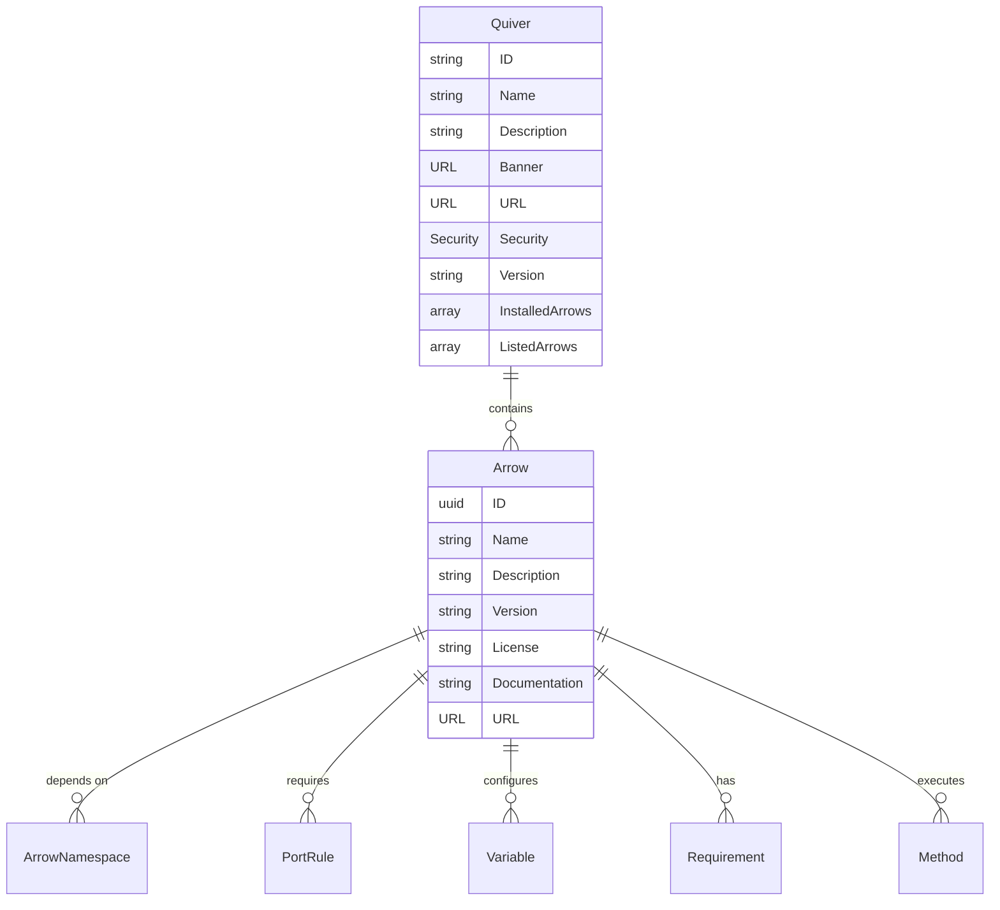
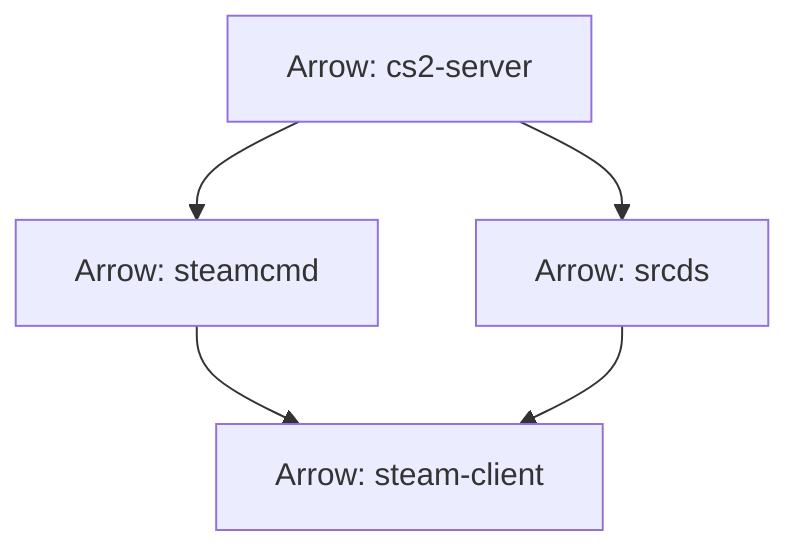
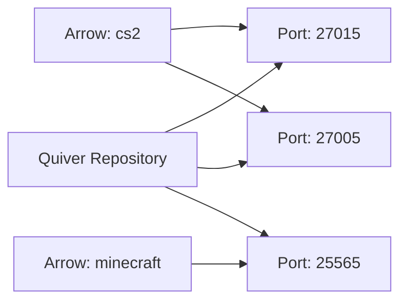

# Domain Models

This document describes the core domain models and their relationships in the Quiver package manager system. These models represent the business entities and define the core domain logic.

## Model Overview

Quiver's domain is centered around two main entities: **Arrows** (packages) and **Quivers** (repositories where packages are found). These entities are supported by various value objects and supporting models.



## Core Entities

### Arrow (Package)

**Location**: `internal/models/arrow/arrow.go`

An Arrow represents a package that can be installed and managed through the Quiver package manager.

```go
type Arrow struct {
    ID            uuid.UUID      `json:"id"`
    Namespace     ArrowNamespace `json:"namespace"`
    ArrowVersion  []string       `json:"arrow_version"`
    Name          string         `json:"name"`
    Description   string         `json:"description"`
    Version       string         `json:"version"`
    License       string         `json:"license"`
    Maintainers   []string       `json:"maintainers"`
    Credits       []string       `json:"credits"`
    URL           system.URL     `json:"url"`
    Documentation string         `json:"documentation"`

    Requirements requirement.Requirement `json:"requirements"`
    Dependencies []ArrowNamespace        `json:"dependencies"`

    Netbridge []port.PortRule     `json:"netbridge"`
    Variables []variable.Variable `json:"variables"`

    Methods []runtime.Method `json:"methods"`
}
```

**Key Properties**:
- **ID**: Unique identifier (UUID)
- **Namespace**: Package namespace (e.g., "cs2", "minecraft")
- **Name**: Human-readable name
- **Version**: Package version
- **Requirements**: System requirements
- **Dependencies**: Other packages this depends on
- **Variables**: Configuration variables
- **Methods**: Platform-specific execution methods

### Quiver (Repository)

**Location**: `internal/models/quiver/quiver.go`

A Quiver represents a repository where Arrow packages are found and managed.

```go
type Quiver struct {
    ID              string                 `json:"id"`
    Name            string                 `json:"name"`
    Description     string                 `json:"description"`
    Banner          system.URL             `json:"banner"`
    URL             system.URL             `json:"url"`
    Security        system.Security        `json:"security"`
    Maintainers     []string               `json:"maintainers"`
    Version         string                 `json:"version"`
    InstalledArrows []arrow.Arrow          `json:"installed_arrows"`
    ListedArrows    []arrow.ArrowNamespace `json:"listed_arrows"`
}
```

**Key Properties**:
- **ID**: Unique identifier
- **Name**: Repository name
- **Security**: Trust level (trusted/untrusted)
- **InstalledArrows**: Currently installed packages
- **ListedArrows**: Available packages for installation

## Supporting Models

### Arrow Namespace

**Location**: `internal/models/arrow/arrow-namespace.go`

Represents a package namespace for dependency management.

```go
type ArrowNamespace struct {
    Namespace string `json:"namespace"`
    Name      string `json:"name"`
}
```

**Examples**:
- `{Namespace: "cs2", Name: "server"}`
- `{Namespace: "minecraft", Name: "vanilla"}`

### Port Rules

**Location**: `internal/models/port/port.go`

Defines network port requirements for Arrow packages.

```go
type PortRule struct {
    Name     string   `json:"name"`
    Protocol Protocol `json:"protocol"`
    Port     int      `json:"port"`
    Required bool     `json:"required"`
}
```

**Protocol Types**:
```go
type Protocol string

const (
    ProtocolTCP Protocol = "tcp"
    ProtocolUDP Protocol = "udp"
    ProtocolBoth Protocol = "tcp/udp"
)
```

### Variables

**Location**: `internal/models/variable/variable.go`

Configuration variables for Arrow packages.

```go
type Variable struct {
    Name      string       `json:"name"`
    Default   string       `json:"default"`
    Values    []string     `json:"values"`
    Min       int          `json:"min"`
    Max       int          `json:"max"`
    Sensitive bool         `json:"sensitive"`
    Type      VariableType `json:"type"`
}
```

**Variable Types**:
```go
type VariableType string

const (
    VariableTypeString  VariableType = "string"
    VariableTypeNumber  VariableType = "number"
    VariableTypeBoolean VariableType = "boolean"
    VariableTypeSelect  VariableType = "select"
)
```

### Requirements

**Location**: `internal/models/requirement/requirement.go`

System requirements for Arrow packages.

```go
type Requirement struct {
    CpuCores int       `json:"cpu_cores"`
    Memory   int       `json:"memory"`
    Disk     int       `json:"disk"`
    OS       system.OS `json:"os"`
}
```

**Validation**:
```go
func (r *Requirement) IsValid() bool {
    return r.CpuCores > 0 && r.Memory > 0 && r.Disk > 0 && r.OS.IsValid()
}
```

### Runtime Methods

**Location**: `internal/models/runtime/method.go`

Platform-specific execution methods.

```go
type Method struct {
    Platform string            `json:"platform"`
    Actions  map[string]string `json:"actions"`
}
```

**Supported Actions**:
- `install`: Package installation
- `execute`: Package execution
- `uninstall`: Package removal
- `update`: Package update
- `validate`: Package validation

## System Models

### Operating System

**Location**: `internal/models/system/os.go`

Represents supported operating systems.

```go
type OS string

const (
    OSWindows OS = "windows"
    OSLinux   OS = "linux"
    OSMacOS   OS = "macos"
)
```

### Security Levels

**Location**: `internal/models/system/security.go`

Defines security trust levels.

```go
type Security string

const (
    SecurityTrusted   Security = "trusted"
    SecurityUntrusted Security = "untrusted"
)
```

### URLs

**Location**: `internal/models/system/url.go`

URL handling and validation.

```go
type URL string

func (u URL) IsValid() bool {
    // URL validation logic
}
```

## Model Relationships

### Arrow Dependencies



**Dependency Resolution**:
1. **Direct Dependencies**: Explicitly declared dependencies
2. **Transitive Dependencies**: Dependencies of dependencies
3. **Conflict Resolution**: Version conflict handling
4. **Circular Dependencies**: Detection and prevention

### Port Management



**Port Allocation**:
1. **Automatic Assignment**: Available port detection
2. **Conflict Resolution**: Port conflict handling
3. **Port Forwarding**: Network configuration via netbridge
4. **Port Validation**: Port availability checking

## Business Rules

### Arrow Installation Rules

1. **Dependency Resolution**: All dependencies must be satisfied
2. **System Requirements**: System must meet minimum requirements
3. **Port Availability**: Required ports must be available
4. **Security Validation**: Package signature verification

### Quiver Repository Rules

1. **Package Management**: Manage multiple Arrow packages
2. **Resource Limits**: System resource constraints
3. **Security Isolation**: Untrusted packages isolation
4. **State Management**: Consistent state across operations

## Data Validation

### Arrow Validation

```go
func (a *Arrow) IsValid() bool {
    return a.ID != uuid.Nil &&
           a.Name != "" &&
           a.Version != "" &&
           a.Requirements.IsValid() &&
           len(a.Methods) > 0
}
```

### Quiver Validation

```go
func (q *Quiver) IsValid() bool {
    return q.ID != "" &&
           q.Name != "" &&
           q.Security.IsValid() &&
           q.Version != ""
}
```

## Example Models

### CS2 Server Arrow

```yaml
# arrow.dev/cs2.yaml
metadata:
  name: "Counter-Strike 2 SRCDS"
  description: "A basic Counter-Strike 2 Dedicated Server"
  version: "0.0.1"
  license: "MIT"

requirements:
  minimum:
    cpu_cores: 2
    ram_gb: 4
    disk_gb: 30
    network_mbps: 10

variables:
  - name: "SERVER_HOSTNAME"
    default: "CS2 Server hosted with Quiver"
  - name: "MAX_PLAYERS"
    default: 12
    min: 2
    max: 64

netbridge:
  - name: "GAME_PORT"
    protocol: "tcp/udp"

methods:
  windows:
    install: 
      - "${steamcmd.execute} +login anonymous +force_install_dir ${INSTALL_PATH} +app_update 730 validate +quit"
    execute:
      - "${INSTALL_PATH}\\cs2.exe -dedicated -console -usercon +hostname ${SERVER_HOSTNAME} +map ${DEFAULT_MAP} +maxplayers ${MAX_PLAYERS} +sv_password ${SERVER_PASSWORD} -port ${GAME_PORT}"
```

### Chat Application Arrow

```yaml
# arrow.dev/chat.yaml
metadata:
  name: "Real-time Chat"
  description: "A simple real-time chat application"
  version: "0.1.0"
  license: "MIT"

requirements:
  minimum:
    cpu_cores: 1
    ram_gb: 1
    disk_gb: 5
    network_mbps: 5

variables:
  - name: "CHAT_PORT"
    default: "8080"
  - name: "MAX_USERS"
    default: "100"
    min: 10
    max: 1000

netbridge:
  - name: "CHAT_PORT"
    protocol: "tcp"
```

## Model Serialization

### JSON Serialization

All models support JSON serialization for API communication:

```go
// Serialize to JSON
arrowJSON, err := json.Marshal(arrow)

// Deserialize from JSON
var arrow Arrow
err := json.Unmarshal(arrowJSON, &arrow)
```

### YAML Serialization

Arrow packages use YAML for configuration:

```go
// Load from YAML
var arrow Arrow
err := yaml.Unmarshal(yamlData, &arrow)
```

## Testing Models

### Unit Tests

Each model has comprehensive unit tests:

```go
func TestArrow_IsValid(t *testing.T) {
    arrow := &Arrow{
        ID:   uuid.New(),
        Name: "test-arrow",
        // ... other fields
    }
    
    if !arrow.IsValid() {
        t.Error("Expected valid arrow")
    }
}
```

### Integration Tests

Model relationships are tested through integration tests:

```go
func TestArrow_WithDependencies(t *testing.T) {
    // Test dependency resolution
    // Test conflict detection
    // Test installation order
}
```

## Model Evolution

### Versioning Strategy

1. **Backward Compatibility**: New fields are optional
2. **Migration Support**: Data migration utilities
3. **Deprecation Process**: Gradual field deprecation
4. **Breaking Changes**: Major version increments

### Extension Points

1. **Custom Fields**: Additional metadata support
2. **Plugin System**: Custom model extensions
3. **Validation Rules**: Custom validation logic
4. **Serialization**: Custom serialization formats

---

*For implementation details, see the [Project Structure](project-structure.md) and [Architecture Overview](architecture-overview.md) documentation.*
