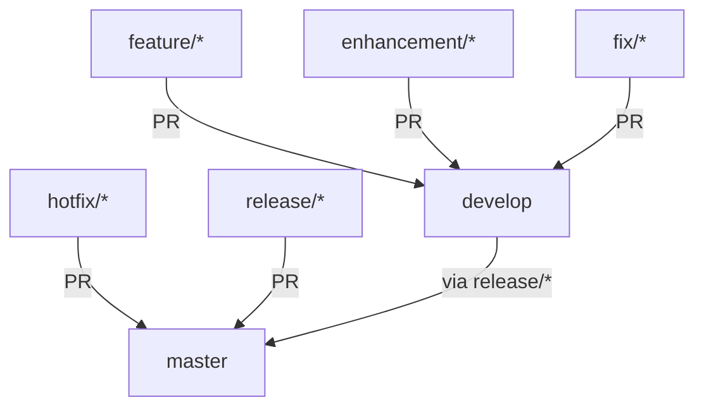

# Git Workflow & Branching Model

This document describes the branching model, pull request workflow, and CI/CD pipeline for the Quiver project.

## Branching Model Overview

Quiver follows a **Git Flow-inspired branching model** with strict rules for pull requests to ensure code quality and maintain a clean history.

### Core Principles

1. **Protected Branches**: `master` and `develop` are protected branches
2. **PR-Only Integration**: All changes must go through pull requests
3. **Comprehensive CI**: Every PR runs automated checks
4. **Quality Gates**: Minimum 80% overall coverage, 90% PR coverage

## Branch Types

### Main Branches

| Branch | Purpose | Stability | Deployment |
|--------|---------|-----------|------------|
| `master` | Production-ready code | Stable | Production |
| `develop` | Integration branch for features | Semi-stable | Staging |

### Supporting Branches

| Branch Pattern | Purpose | Source | Target | Naming Example |
|---------------|---------|--------|--------|----------------|
| `feature/*` | New features | `develop` | `develop` | `feature/user-authentication` |
| `enhancement/*` | Improvements to existing features | `develop` | `develop` | `enhancement/api-performance` |
| `fix/*` | Bug fixes | `develop` | `develop` | `fix/memory-leak-issue` |
| `hotfix/*` | Critical production fixes | `master` | `master` | `hotfix/security-vulnerability` |
| `release/*` | Release preparation | `develop` | `master` | `release/2024-01-15` |

## Pull Request Rules

### Allowed PR Flows



### Branch Validation Rules

1. **enhancement/*** → **develop** only
2. **feature/*** → **develop** only  
3. **fix/*** → **develop** only
4. **hotfix/*** → **master** only
5. **release/*** → **master** only (must originate from `develop`)

### Invalid PR Attempts

❌ **These will be rejected by CI:**
- `feature/new-api` → `master`
- `hotfix/urgent-fix` → `develop`
- `master` → any branch
- `develop` → any branch (except via `release/*`)
- Branches not following naming conventions

## CI/CD Pipeline

### Pipeline Overview

The CI pipeline runs **only on pull requests** and consists of four main stages:

```
┌─────────────────┐    ┌─────────────────┐    ┌─────────────────┐    ┌─────────────────┐
│  Branch         │    │  Build          │    │  Test Coverage  │    │  Code Quality   │
│  Validation     │    │  Validation     │    │  (Docker)       │    │  & Security     │
└─────────────────┘    └─────────────────┘    └─────────────────┘    └─────────────────┘
         │                       │                       │                       │
         ▼                       ▼                       ▼                       ▼
┌─────────────────────────────────────────────────────────────────────────────────────────┐
│                           PR Validation Complete                                         │
└─────────────────────────────────────────────────────────────────────────────────────────┘
```

### Stage 1: Branch Validation

**Purpose**: Ensures PR follows branching model rules

**Checks**:
- Source branch name matches required patterns
- Target branch is correct for the branch type
- Release branches originate from latest `develop`

**Example Output**:
```
✅ Branch validation passed: feature/new-dashboard → develop
```

### Stage 2: Build Validation

**Purpose**: Ensures code compiles correctly

**Checks**:
- Code formatting (`make fmt`)
- Go vet analysis (`make vet`)
- Successful compilation (`make build`)
- Binary verification

### Stage 3: Test Coverage (Docker)

**Purpose**: Validates test coverage requirements

**Environment**: Tests run in Docker container using `golang:1.24.2-alpine`

**Coverage Requirements**:
- **Overall Project Coverage**: ≥ 80%
- **PR Coverage**: ≥ 90% (for changed files)

**Process**:
1. Run all tests with race detection
2. Generate coverage report
3. Calculate overall project coverage
4. Calculate coverage for PR changes only
5. Fail if either requirement is not met

### Stage 4: Code Quality & Security

**Purpose**: Ensures code quality and security standards

**Tools**:
- **golangci-lint**: Comprehensive Go linting
- **gosec**: Security vulnerability scanning
- **SARIF reporting**: Integration with GitHub Security tab

### Final Validation

All stages must pass for the PR to be considered valid:

```
✅ All PR validation checks passed successfully!

📋 Summary:
- ✅ Branch follows the defined branching model  
- ✅ Code compiles successfully
- ✅ Overall test coverage ≥ 80%
- ✅ PR coverage ≥ 90%
- ✅ Code quality and security checks passed

🎉 This PR is ready for review!
```

## Local Development

### Prerequisites

- Go 1.24.2 or later
- Docker (for testing)
- Make

### Available Make Commands

| Command | Description |
|---------|-------------|
| `make help` | Show all available commands |
| `make setup` | Setup development environment |
| `make run` | Build and run the application locally |
| `make build` | Build the application binary |
| `make test` | Run all tests |
| `make test-coverage` | Run tests with coverage report |
| `make test-docker` | Run tests in Docker (CI environment) |
| `make lint` | Run golangci-lint |
| `make security` | Run security checks |
| `make pr-checks` | Run all PR validation checks locally |
| `make validate-branch` | Validate current branch for PR |

### Development Workflow

1. **Start Development**:
   ```bash
   # Create and switch to feature branch
   git checkout develop
   git pull origin develop
   git checkout -b feature/my-new-feature
   
   # Setup environment
   make setup
   ```

2. **During Development**:
   ```bash
   # Run application
   make run
   
   # Run tests frequently
   make test
   
   # Check coverage
   make test-coverage
   ```

3. **Before Creating PR**:
   ```bash
   # Run all PR checks locally
   make pr-checks
   
   # Validate branch
   make validate-branch
   ```

4. **Create Pull Request**:
   - Push branch to GitHub
   - Create PR targeting appropriate branch
   - CI will automatically run all checks

## Examples

### Example 1: Feature Development

```bash
# 1. Create feature branch from develop
git checkout develop
git pull origin develop
git checkout -b feature/user-dashboard

# 2. Develop and test
make run
make test-coverage

# 3. Validate before PR
make pr-checks

# 4. Create PR: feature/user-dashboard → develop
# CI will automatically validate the PR
```

### Example 2: Hotfix

```bash
# 1. Create hotfix branch from master
git checkout master
git pull origin master
git checkout -b hotfix/critical-security-fix

# 2. Fix and test
make test-docker
make security

# 3. Validate
make pr-checks

# 4. Create PR: hotfix/critical-security-fix → master
```

### Example 3: Release

```bash
# 1. Create release branch from develop
git checkout develop
git pull origin develop
git checkout -b release/2024-01-15

# 2. Prepare release (version bumps, changelog, etc.)
# 3. Test thoroughly
make pr-checks

# 4. Create PR: release/2024-01-15 → master
```

## Troubleshooting

### Common Issues

#### Branch Validation Failures

**Problem**: `❌ Feature branches can only target 'develop', not 'master'`

**Solution**: 
- Change PR target branch to `develop`
- Or rename branch if it should be a hotfix

#### Coverage Failures

**Problem**: `❌ Overall coverage 75% is below required 80%`

**Solutions**:
1. Add tests for uncovered code
2. Remove unused/dead code
3. Check `coverage.html` report for specific areas

**Problem**: `❌ PR coverage 85% is below required 90%`

**Solutions**:
1. Add tests for all new/changed code
2. Ensure comprehensive test coverage for PR changes

#### Build Failures

**Problem**: Code formatting issues

**Solution**:
```bash
make fmt
git add -A
git commit -m "Fix formatting"
```

**Problem**: Compilation errors

**Solution**:
```bash
make build
# Fix reported errors
```

#### Linting Failures

**Problem**: golangci-lint issues

**Solution**:
```bash
make lint
# Fix reported issues
# Common fixes: unused variables, inefficient code, etc.
```

### Getting Help

1. **Check CI logs**: Review failed job details in GitHub Actions
2. **Run locally**: Use `make pr-checks` to reproduce issues locally
3. **Coverage reports**: Download coverage artifacts from failed CI runs
4. **Security issues**: Review gosec reports in GitHub Security tab

### Best Practices

1. **Run `make pr-checks` before creating PRs**
2. **Keep PRs focused and small**
3. **Write tests for all new code**
4. **Follow Go conventions and project structure**
5. **Update documentation when needed**
6. **Use descriptive commit messages**

## Configuration Files

The CI/CD pipeline uses these key files:

- **`.github/workflows/ci.yml`**: GitHub Actions workflow
- **`Makefile`**: Local development and CI commands
- **`go.mod`**: Go module dependencies
- **`Dockerfile`**: Container configuration for testing

## Branch Protection Rules

### Master Branch
- **Require PR reviews**: 2 reviewers
- **Require status checks**: All CI checks must pass
- **Require up-to-date branches**: Must be up-to-date with target
- **Restrict pushes**: No direct pushes allowed

### Develop Branch
- **Require PR reviews**: 1 reviewer
- **Require status checks**: All CI checks must pass
- **Require up-to-date branches**: Must be up-to-date with target
- **Restrict pushes**: No direct pushes allowed

## Release Process

### Creating a Release

1. **Create Release Branch**:
   ```bash
   git checkout develop
   git pull origin develop
   git checkout -b release/2024-01-15
   ```

2. **Update Version**:
   - Update version in `go.mod`
   - Update version in configuration files
   - Update changelog

3. **Test Release**:
   ```bash
   make pr-checks
   make test-docker
   ```

4. **Create PR**: `release/2024-01-15` → `master`

5. **Merge and Tag**:
   - Merge PR to master
   - Create git tag: `v1.0.0`
   - Push tag to trigger release

### Hotfix Process

1. **Create Hotfix Branch**:
   ```bash
   git checkout master
   git pull origin master
   git checkout -b hotfix/critical-fix
   ```

2. **Fix and Test**:
   ```bash
   make pr-checks
   make security
   ```

3. **Create PR**: `hotfix/critical-fix` → `master`

4. **Merge to Both Branches**:
   - Merge to master
   - Cherry-pick to develop

## Commit Message Guidelines

### Format
```
<type>(<scope>): <description>

[optional body]

[optional footer]
```

### Types
- **feat**: New feature
- **fix**: Bug fix
- **docs**: Documentation changes
- **style**: Code style changes
- **refactor**: Code refactoring
- **test**: Test changes
- **chore**: Build process or auxiliary tool changes

### Examples
```
feat(api): add arrow search endpoint
fix(ui): resolve memory leak in TUI model
docs(readme): update installation instructions
test(repository): add integration tests for arrows
```

---

*For questions about the branching model or CI/CD process, please create an issue or discuss in team meetings.*
