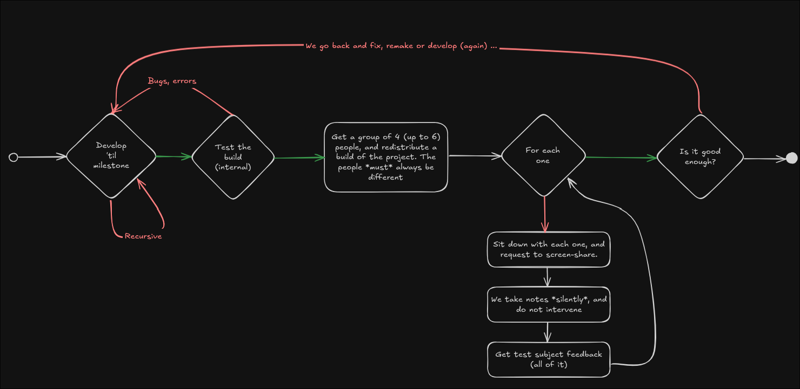

# Testing Workflow

This document describes the structured testing workflow used at Rabbyte to ensure the quality of our builds and catch issues early in the development process.

## Overview

At Rabbyte, we follow a structured testing workflow to ensure the quality of our builds. This recursive process helps us catch issues early and refine the product iteratively.

## Testing Process

### 1. Develop 'til Milestone

Development continues until a specific milestone is reached. This ensures we have a complete feature or set of features to test rather than testing incomplete functionality.

**Key Points:**
- Focus on completing features before testing
- Define clear milestones and acceptance criteria
- Ensure all planned functionality is implemented

### 2. Test the Build (Internal)

The build is tested internally to identify bugs and errors. If issues are found, we go back to fix, remake, or redevelop as needed.

**Internal Testing Process:**
- **Unit Testing**: Automated tests for individual components
- **Integration Testing**: Testing component interactions
- **System Testing**: End-to-end functionality testing
- **Manual Testing**: Human verification of features
- **Performance Testing**: Load and stress testing
- **Security Testing**: Vulnerability assessment

**Quality Gates:**
- All automated tests must pass
- Code coverage requirements met
- Performance benchmarks satisfied
- Security scans clean
- Manual testing completed

### 3. Distribute to External Testers

A group of 4–6 external testers is selected, and the build is redistributed. It's important that the testers are always different for each round of testing to get fresh perspectives.

**Tester Selection Criteria:**
- **Diversity**: Different backgrounds, skill levels, and use cases
- **Fresh Eyes**: New testers for each round to avoid bias
- **Representative Users**: Mix of technical and non-technical users
- **Different Platforms**: Various operating systems and environments

### 4. Tester Session Process

For each tester, we follow a structured session process:

#### Session Setup
- **Screen Sharing**: Tester shares their screen for observation
- **Environment**: Natural testing environment (their own setup)
- **Time**: Dedicated time slot for thorough testing
- **Documentation**: Note-taking tools ready

#### During the Session
- **Silent Observation**: Take notes silently without intervening
- **Natural Usage**: Let testers use the software as they would normally
- **Problem Discovery**: Note any confusion, errors, or issues
- **Feedback Collection**: Gather all feedback from the tester
- **Behavioral Notes**: Observe how they interact with the interface

#### Information Collected
- **Usability Issues**: Where testers get confused or stuck
- **Bug Reports**: Actual errors and unexpected behavior
- **Feature Requests**: Suggestions for improvements
- **Performance Issues**: Slow or unresponsive areas
- **Workflow Problems**: Inefficient or confusing processes

### 5. Evaluate Feedback

Based on the feedback, determine if the build is "good enough." If not, the process loops back to development.

**Evaluation Criteria:**
- **Critical Issues**: Blocking bugs that prevent core functionality
- **Usability Problems**: Issues that make the software hard to use
- **Performance Issues**: Problems affecting speed or responsiveness
- **User Satisfaction**: Overall experience and satisfaction levels
- **Feature Completeness**: Whether all planned features work as expected

**Decision Process:**
- **Ship**: If feedback is positive and no critical issues exist
- **Iterate**: If issues are found but are minor and can be addressed quickly
- **Redevelop**: If major issues are discovered that require significant changes

## Quality Assurance Principles

### Early Detection
- Catch issues as early as possible in the development cycle
- Use automated testing to catch regressions quickly
- Regular testing prevents issues from accumulating

### User-Centric Testing
- Test with real users in real environments
- Focus on user experience and usability
- Consider different user types and use cases

### Iterative Improvement
- Each testing cycle should improve the product
- Learn from each round of feedback
- Continuously refine the testing process

### Documentation
- Document all issues found during testing
- Track resolution of problems
- Maintain testing history for future reference

## Testing Tools and Methods

### Automated Testing
- **Unit Tests**: Individual component testing
- **Integration Tests**: Component interaction testing
- **End-to-End Tests**: Complete workflow testing
- **Performance Tests**: Load and stress testing
- **Security Tests**: Automated vulnerability scanning

### Manual Testing
- **Exploratory Testing**: Free-form testing to discover issues
- **Usability Testing**: Focus on user experience
- **Compatibility Testing**: Cross-platform and cross-browser testing
- **Accessibility Testing**: Ensuring software is usable by all users

### User Testing
- **Beta Testing**: External user testing
- **Usability Studies**: Structured user experience research
- **Feedback Collection**: Systematic gathering of user opinions
- **A/B Testing**: Comparing different approaches

## Best Practices

### For Developers
- **Test-Driven Development**: Write tests before implementing features
- **Regular Testing**: Test frequently during development
- **Code Reviews**: Peer review of code changes
- **Documentation**: Keep testing documentation up to date

### For Testers
- **Realistic Scenarios**: Test with real-world use cases
- **Honest Feedback**: Provide candid feedback about issues
- **Detailed Reporting**: Document issues thoroughly
- **Follow-up**: Participate in issue resolution discussions

### For Project Management
- **Milestone Planning**: Set clear testing milestones
- **Resource Allocation**: Ensure adequate time for testing
- **Feedback Integration**: Incorporate testing feedback into planning
- **Quality Metrics**: Track quality metrics over time

## Continuous Improvement

### Process Refinement
- **Retrospectives**: Regular review of testing process effectiveness
- **Tool Updates**: Keep testing tools and methods current
- **Training**: Continuous improvement of testing skills
- **Methodology**: Evolve testing approaches based on learnings

### Metrics and Monitoring
- **Bug Tracking**: Monitor bug discovery and resolution rates
- **User Satisfaction**: Track user feedback and satisfaction scores
- **Performance Metrics**: Monitor system performance over time
- **Quality Trends**: Analyze quality trends and patterns

## Integration with Development Workflow

### Git Workflow Integration
- **Branch Testing**: Test each feature branch before merging
- **Pull Request Testing**: Automated testing on pull requests
- **Release Testing**: Comprehensive testing before releases
- **Hotfix Testing**: Rapid testing for critical fixes

### CI/CD Integration
- **Automated Testing**: Run tests automatically on code changes
- **Quality Gates**: Prevent deployment of low-quality code
- **Performance Monitoring**: Continuous performance testing
- **Security Scanning**: Automated security vulnerability detection

---

*This testing workflow ensures that we deliver high-quality software that meets user needs and expectations. For more information about our development process, see the [Git Workflow](git-workflow.md) and [Contributing Guide](contributing-guide.md) documentation.*
